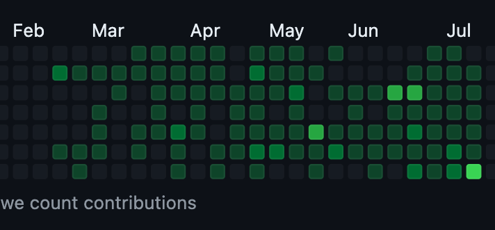
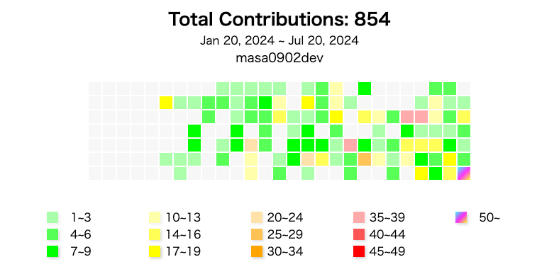

# Github Graphs

## ✅ user contribution graph

original github contribution graph | this contribution graph
-- | --
 | 

These graphs show user’s contributions as absolute values unlike GitHub, Relative values.  
So you see at a glance how many contributions the user has.

it helps engineers, managers, and HR people.  
Engineers can show how much they are contributing to the project, and managers and HR people can assess engineers with this product.
